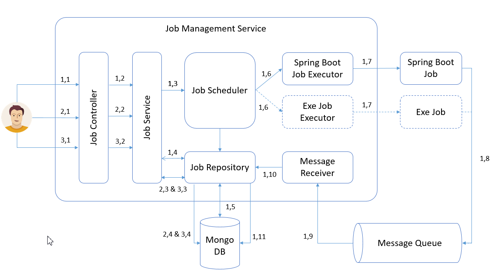

# Getting Started

### Live At :  https://jm-service.herokuapp.com/api/swagger-ui.html 

### Project Architecture



* Job Submission
    * 1,1 : User posts a job with job file and other request parameters.
    * 1,2 : Job controller propagates request to job services.
    * 1,3 : Job service validates the request, saves the file and schedules the job for execution.
    * 1,4 & 1.5 : Job service  saves the job details to db with job status as 'QUEUED'.
    * 1,6 : Job scheduler triggers the specific job executor based on job type.
    * 1.7 : The job executor executes the job.
    * 1.8 : Job status/event updates are pushed by the job to message queue.
    * 1.9 & 1.10 : message receiver updates the job status in repository with 'RUNNING | FAILED | SUCCESS'.   

* Job Retrieve Job By Id 
    * 2,1 : User requests a job details with job id.
    * 2,2 : Job controller propagates request to job services.   
    * 2,3 & 2,3 & 2,4 : Job service then retrieves the job details from db and returns the same as response.   
    
* Job Retrieve All Jobs
    * 3,1 : User requests for all jobs.
    * 3,2 : Job controller propagates request to job services.   
    * 3,3 & 3,3 & 3,4 : Job service then retrieves all job details from db and returns the same as response. 
     
### Project Modules
The project consists of following modules:
* [Job Management Service](https://github.com/CaseStudy-JobManagement/jm-service) : spring boot service for submitting and retrieving jobs, with following features.
    * Submit job
    * Retrieve job by id
    * Retrieve all jobs
* Job Modules
    * [Job Starter](https://github.com/CaseStudy-JobManagement/jm-job-starter) : spring boot starter job for creating jobs. 
    * [Job Logger](https://github.com/CaseStudy-JobManagement/jm-job-logger) : simple job which logs 'Hello'. 
    * [Job Weather Report Dweet](https://github.com/CaseStudy-JobManagement/jm-job-weather-report-dweet) : 
        * Retrieves the weather report for specified city from 'openweathermap' API's. 
        * Push the same to dweet thing service. 
        * The data can be viewed at freeboard : https://freeboard.io/board/7cqslZ 
    * [Job Weather Report Email](https://github.com/CaseStudy-JobManagement/jm-job-weather-report-email) : 
        * Retrieves the weather report for specified city from 'openweathermap' API's 
        * Emails the same to mail id specified in parameter.

### Build & Run
* Build [Job Starter](https://github.com/CaseStudy-JobManagement/jm-job-starter) : job starter is to be built before building any job.
    * **Build it** : *mvnw.cmd clean install*

* Build Actual Jobs:
    * [Job Logger](https://github.com/CaseStudy-JobManagement/jm-job-logger)  
    * [Job Weather Report Dweet](https://github.com/CaseStudy-JobManagement/jm-job-weather-report-dweet) 
    * [Job Weather Report Email](https://github.com/CaseStudy-JobManagement/jm-job-weather-report-email)
        * **Build it** : *mvnw.cmd clean package*
    **Note**: the generated jar files are to be used as job files for job service.

* Build Job Service:        
    * **Build it** : *mvnw.cmd clean package*
    * **Run It** : *java -jar target\jm-service-0.0.1-SNAPSHOT.jar*
    * **Test Via API Swagger** http://localhost:8080/api/swagger-ui.html

### API Usage
 * Job Submission 
     * Request URL : http://localhost:8080/api/job
     * Request Body:
        ```
        form : {job}.jar
        jobType : SPRING_BOOT_JAR
        executionType : IMMEDIATE
        parameters : 'optional, space seperated parameter for job'
        environmentString : 'optional, space seperated environment variable for job'
        priority : 'optional, int value representing job priority (1-10)' 
        schedule : 'optional, schedule represented in 'yyyy-MM-dd HH:mm:ss' format' 
        ```
     * Response Header:
        ```
        Location : http://localhost:8080/api/job/{jobId} 
        ```
     * Response Status:
        ```
        201
        ```
 * Get Job By Id
     * Request URL : http://localhost:8080/api/job/{jobId} 
     * Response Body:
        ```
        {
          "id": {jobId},
          "type": "SPRING_BOOT_JAR",
          "status": "{QUEUED | FAILED | SUCCESS}",
          "fileLocation": ".store/{jobId}.jar",
          "schedule": {
            "executionType": "IMMEDIATE"
          }
        }
        ```
     * Response Status:
        ```
        200
        ```
  * Get All Jobs 
      * Request URL : http://localhost:8080/api/job
      * Response Body:
         ```
         [
             {
               "id": {jobId},
               "type": "SPRING_BOOT_JAR",
               "status": "{QUEUED | FAILED | SUCCESS}",
               "fileLocation": ".store/{jobId}.jar",
               "schedule": {
                 "executionType": "IMMEDIATE"
               }
             }
             ...
         ]
         ```
      * Response Status:
         ```
         200
         ```                

### Running jobs
* Built jars are available at : https://github.com/CaseStudy-JobManagement/jm-service/releases/tag/1.0
* Running Logger Jobs   
    * On Live / On Local
        * Request Body:
           ```
           form : {job}.jar
           jobType : SPRING_BOOT_JAR
           executionType : IMMEDIATE
           ```      
* Running Email Jobs   
    * On Live Only
        * Request Body:
           ```
           form : {job}.jar
           jobType : SPRING_BOOT_JAR
           executionType : IMMEDIATE
           parameter : {city} {mailid} ex :'bangalore anant.c.pawar@gmail.com'
           ```     
* Running Dweet Jobs   
    * On Live 
        * Request Body:
           ```
           form : {job}.jar
           jobType : SPRING_BOOT_JAR
           executionType : IMMEDIATE
           parameter : {city} ex : 'bangalore'
           ```     
     * On Local 
         * Request Body:
            ```
            form : {job}.jar
            jobType : SPRING_BOOT_JAR
            executionType : IMMEDIATE
            parameter : {city} ex : 'bangalore'
            environmentString: -DWEATHER_APP_KEY=fce6cd92d51667ad4e8eae6ae2d4fb3c
            ```       
                                     
### Development Operations
[Job Management Service Travis CI Build](https://travis-ci.org/CaseStudy-JobManagement/jm-service)
: Have integrated code repo with Travis CI which builds the app does following :

* perform and publish, code analysis and code coverage result to sonar cloud.
    * [Job Management Service Sonar Report](https://sonarcloud.io/dashboard?id=CaseStudy-JobManagement_jm-service)
* The service is currently hosted on Heroku on free dyno.
    * [Job Management Service Live](https://jm-service.herokuapp.com/api/swagger-ui.html)
    
### Guides
The following guides illustrate how to use some features concretely:

* [Building a RESTful Web Service](https://spring.io/guides/gs/rest-service/)
* [Building REST services with Spring](https://spring.io/guides/tutorials/bookmarks/)

